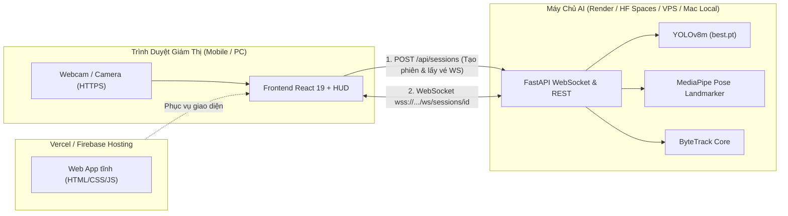

# 🌐 CẨM NANG TRIỂN KHAI TOÀN DIỆN (DEPLOYMENT GUIDE)
## Hệ Thống Giám Sát Tư Thế Phòng Thi — VisionGuard AI (YOLOv8 + MediaPipe)

Tài liệu này hướng dẫn chi tiết từng bước (A đến Z) cách đưa toàn bộ hệ thống VisionGuard AI từ môi trường phát triển (Local) lên môi trường trực tuyến (Internet/Production) để người dùng, giám thị hoặc hội đồng đánh giá có thể truy cập qua điện thoại, máy tính bảng hoặc máy tính cá nhân ở bất cứ đâu.

---

## 🗺️ 1. KIẾN TRÚC HỆ THỐNG TRIỂN KHAI

Hệ thống VisionGuard AI gồm 2 thành phần độc lập nhưng gắn kết chặt chẽ:



### Tại sao lại chia tách như trên?
1. **Frontend (React/Vite)**: Hoàn toàn là file tĩnh, cần **bắt buộc chạy trên giao thức HTTPS** để trình duyệt (Chrome, Safari, Edge) cấp quyền truy cập Camera/Webcam. Triển khai lên **Vercel** hoặc **Firebase Hosting** chỉ mất 1 phút và **hoàn toàn miễn phí**.
2. **Backend AI (Python FastAPI + YOLOv8 + MediaPipe)**: Đây là bộ não tính toán thị giác máy tính (Computer Vision) nặng, nhận luồng ảnh JPEG 5–10 FPS và giải ma trận 3D SolvePnP liên tục qua WebSocket dài hạn (Persistent Connection). Không thể chạy trên Serverless (như Vercel Serverless hay AWS Lambda thông thường). Cần chạy trên Server/Container (Render, VPS, Hugging Face Spaces) hoặc chạy trực tiếp trên máy Mac kết nối qua Secure Tunnel.

---

## 🚀 2. BA PHƯƠNG ÁN TRIỂN KHAI CHI TIẾT

| Phương Án | Frontend | Backend AI | Chi Phí | Tốc Độ & Độ Mượt | Phù Hợp Cho |
| :--- | :--- | :--- | :--- | :--- | :--- |
| **Phương Án 1 (Khuyên Dùng)** | Vercel (Miễn phí) | Chạy trên Mac + Cloudflare Tunnel | **0đ** | **Cực nhanh (30-60 FPS)** | Báo cáo đồ án, thuyết trình, test trực tiếp trên điện thoại |
| **Phương Án 2 (Độc Lập Cloud)** | Vercel (Miễn phí) | Render.com / Hugging Face Spaces | **0đ** | **15-25 FPS** | Chạy 24/7 không cần bật máy tính cá nhân |
| **Phương Án 3 (Server Riêng VPS)** | Docker Nginx | Docker Container | **Có phí VPS** | **Rất ổn định** | Môi trường thi cử thực tế tại trường / tổ chức |

---

### 🔥 PHƯƠNG ÁN 1: VERCEL FRONTEND + LOCAL AI BACKEND QUA TUNNEL (KHUYÊN DÙNG CHO DEMO & BÁO CÁO)

Đây là cách thông minh nhất: Tận dụng vi xử lý Apple Silicon (M1/M2/M3/M4) trên máy Mac của bạn để tính toán AI với tốc độ cực đại mà **không tốn 1 đồng chi phí thuê GPU đám mây**. Mọi người bên ngoài (qua điện thoại/máy tính khác) vẫn truy cập trang web online bình thường!

#### Bước 1: Đẩy mã nguồn mới nhất lên GitHub
Toàn bộ mã nguồn đã sẵn sàng tại kho: `https://github.com/danhhoa20005/exam-monitor`

```bash
git add .
git commit -m "feat: complete deployment configurations for Vercel and Render"
git push origin main
```

#### Bước 2: Deploy Frontend lên Vercel (Chỉ mất 60 giây)
1. Truy cập [vercel.com](https://vercel.com) và đăng nhập bằng tài khoản GitHub `danhhoa20005`.
2. Bấm nút **"Add New..."** ➔ Chọn **"Project"**.
3. Tìm kho lưu trữ **`exam-monitor`** và bấm **"Import"**.
4. Cấu hình dự án (Project Configuration):
   - **Framework Preset**: Chọn `Vite`.
   - **Root Directory**: Để trống hoặc chọn `./` (Dự án đã có sẵn `vercel.json` ở thư mục gốc).
   - *(Tùy chọn)* Nếu muốn cố định link backend ngay từ đầu: Thêm biến môi trường **`VITE_API_BASE_URL`** với giá trị URL tunnel của bạn (Ví dụ: `https://visionguard.trycloudflare.com`). Nếu chưa có, bạn hoàn toàn có thể để trống và nhập trực tiếp trên giao diện web sau!
5. Bấm **"Deploy"**. Đợi khoảng 40 giây, Vercel sẽ cấp cho bạn một tên miền HTTPS chính thức (Ví dụ: `https://exam-monitor.vercel.app`).

#### Bước 3: Khởi động AI Server trên máy Mac & mở kết nối Internet
Mở Terminal trên máy Mac của bạn và chạy:

```bash
# Cách A: Mở Cloudflare Tunnel (Khuyên dùng, không có trang cảnh báo)
npm run tunnel

# HOẶC Cách B: Dùng LocalTunnel
npm run ai-server
```

Terminal sẽ hiển thị đường link public Internet, ví dụ:
```text
https://xxx-xxx-xxx.trycloudflare.com
```

#### Bước 4: Kết nối và sử dụng
1. Lấy điện thoại hoặc máy tính của bạn mở đường link Vercel: `https://exam-monitor.vercel.app`.
2. Bấm vào icon **Cài đặt bánh răng (⚙️)** ở góc trên thanh điều khiển.
3. Dán đường link `https://xxx-xxx-xxx.trycloudflare.com` vừa nhận được vào ô **"Máy Chủ AI Backend"**.
4. Bấm **"Lưu Cấu Hình"**.
5. Đèn báo trạng thái sẽ ngay lập tức chuyển sang **Xanh lục (Đã kết nối Live WebSocket)**! Camera trên điện thoại sẽ stream trực tiếp về máy AI và trả về kết quả bounding box và phân tích tư thế thời gian thực!

---

### ☁️ PHƯƠNG ÁN 2: DEPLOY TOÀN BỘ LÊN CLOUD (RENDER.COM HOẶC HUGGING FACE SPACES)

Nếu bạn cần hệ thống tự chạy online 24/7 mà không cần mở máy tính cá nhân.

#### Cách 2.1: Triển khai Backend lên Render.com
Dự án đã được cấu hình sẵn file `render.yaml` và `backend/Dockerfile`.

1. Đăng ký/Đăng nhập tại [render.com](https://render.com).
2. Tại bảng điều khiển Render, chọn **"New +"** ➔ **"Blueprint"** (hoặc chọn **"Web Service"**).
3. Kết nối với repo GitHub `danhhoa20005/exam-monitor`.
4. Nếu dùng **Web Service (Docker)** thủ công:
   - **Name**: `visionguard-ai-backend`
   - **Runtime**: `Docker`
   - **Dockerfile Path**: `./backend/Dockerfile`
   - **Docker Context**: `./backend`
   - **Instance Type**: Chọn gói có RAM tối thiểu 1GB (Nếu dùng gói Free 512MB, lưu ý không mở đồng thời quá nhiều tab camera để tránh tràn RAM).
5. Biến môi trường (Environment Variables):
   - `PORT`: `8000`
   - `DEMO_ACCESS_CODE`: `demo2026`
   - `SECRET_KEY`: nhập một chuỗi ngẫu nhiên bí mật.
6. Bấm **"Create Web Service"**.
7. Render sẽ tự động build image Docker và khởi chạy. Khi hoàn tất, bạn nhận được URL dạng: `https://visionguard-ai-backend.onrender.com`.
8. Sau đó, vào Vercel (Frontend) ➔ **Project Settings** ➔ **Environment Variables** ➔ Thêm:
   - Key: `VITE_API_BASE_URL`
   - Value: `https://visionguard-ai-backend.onrender.com`
   ➔ Bấm **Redeploy** lại Vercel là xong!

#### Cách 2.2: Triển khai Backend lên Hugging Face Spaces (Cực kỳ mạnh & Miễn phí 16GB RAM)
Hugging Face cung cấp hạ tầng miễn phí 2 vCPU + 16GB RAM (gấp 32 lần Render Free):

1. Tạo tài khoản tại [huggingface.co](https://huggingface.co).
2. Chọn **"New Space"**.
3. Đặt tên (Ví dụ: `exam-monitor-backend`).
4. Chọn **Space SDK**: **Docker** ➔ **Blank**.
5. License: Apache 2.0 hoặc MIT.
6. Kết nối GitHub repo hoặc push code vào Space. Space sẽ tự động build Dockerfile và cấp link HTTPS/WSS công khai!

---

### 🐳 PHƯƠNG ÁN 3: TRIỂN KHAI TẤT CẢ VÀO MỘT DOCKER CONTAINER DUY NHẤT (VPS)

Dành cho việc đưa lên VPS Ubuntu (DigitalOcean, Linode, AWS EC2, GCP):

Hệ thống đã hỗ trợ cơ chế phục vụ Single-Bundle: Backend FastAPI tự động phục vụ file build tĩnh của Frontend nếu phát hiện thư mục `dist`.

#### Lệnh build & chạy container thống nhất:
```bash
# 1. Build Frontend
cd frontend && npm install && npm run build && cd ..

# 2. Copy dist sang backend
cp -r frontend/dist backend/dist

# 3. Build & Run Docker Container
docker build -t visionguard-ai:latest -f backend/Dockerfile backend/
docker run -d -p 8000:8000 --name visionguard-app visionguard-ai:latest
```

Khi đó, truy cập thẳng vào `http://<IP-CUA-VPS>:8000`: Bạn sẽ thấy ngay giao diện Frontend, đồng thời WebSocket kết nối nội bộ tức thì không cần cấu hình thêm bất kỳ tham số nào!

---

## ⚙️ 3. TỔNG HỢP BIẾN MÔI TRƯỜNG (ENVIRONMENT VARIABLES)

### Frontend (Vercel / Local `.env`)
| Tên Biến | Bắt Buộc | Mặc Định | Ý Nghĩa |
| :--- | :---: | :--- | :--- |
| `VITE_API_BASE_URL` | Không | `window.location.origin` (PROD) / `http://127.0.0.1:8000` (DEV) | Địa chỉ HTTP/HTTPS của máy chủ AI Backend |
| `VITE_WS_URL` | Không | Tự động chuyển đổi từ `VITE_API_BASE_URL` (`http` ➔ `ws`, `https` ➔ `wss`) | Địa chỉ WebSocket máy chủ AI |

### Backend (`backend/.env` hoặc Docker / Render)
| Tên Biến | Bắt Buộc | Mặc Định | Ý Nghĩa |
| :--- | :---: | :--- | :--- |
| `PORT` | Không | `8000` | Cổng dịch vụ lắng nghe |
| `DEMO_ACCESS_CODE` | Có | `demo2026` | Mã truy cập dành cho giám thị phòng thi |
| `SECRET_KEY` | Có | `exam-monitor-secret-key-2026-secure-token` | Khóa mã hóa tạo vé WebSocket ticket |
| `DEBUG` | Không | `False` | Bật/tắt chế độ debug |

---

## 🛠️ 4. XỬ LÝ SỰ CỐ THƯỜNG GẶP (TROUBLESHOOTING)

### 1. Trình duyệt không mở được Camera trên điện thoại
- **Nguyên nhân**: Bạn đang mở trang web qua giao thức không bảo mật `http://` (không phải `https://` hoặc `localhost`).
- **Khắc phục**: Luôn truy cập qua domain Vercel có `https://...`. Trình duyệt chỉ cấp quyền Camera khi chạy trên `https://` hoặc `localhost`.

### 2. Giao diện báo lỗi "Không thể kết nối AI backend"
- **Nguyên nhân**: Máy chủ AI chưa chạy, hoặc link Tunnel/Render bị nhập sai, hoặc Tunnel đã bị tắt.
- **Khắc phục**:
  1. Kiểm tra xem lệnh `npm run tunnel` trên máy tính còn đang chạy không.
  2. Bấm biểu tượng ⚙️ trên web, kiểm tra ô **Máy Chủ AI Backend** đã nhập đúng link bắt đầu bằng `https://...` chưa.
  3. Bấm **Lưu Cấu Hình** để hệ thống thử kết nối lại.

### 3. Render Free Tier phản hồi chậm khi mới mở lần đầu
- **Nguyên nhân**: Gói Free của Render sẽ tự động "ngủ đông" (sleep) nếu không có lượt truy cập trong 15 phút.
- **Khắc phục**: Khi truy cập lần đầu sau thời gian nghỉ, bạn đợi khoảng 30–50 giây để Render đánh thức container dậy. Sau đó hệ thống sẽ hoạt động mượt mà bình thường.

---

> [!TIP]
> **Khuyên dùng cho buổi báo cáo**: Khởi động Backend trên Mac bằng lệnh `npm run tunnel`, lấy URL Cloudflare dán vào trang Vercel trên điện thoại hoặc máy của hội đồng. Độ trễ phân tích tư thế chỉ khoảng 20-40ms, FPS đạt 30-60 cực kỳ ấn tượng!
